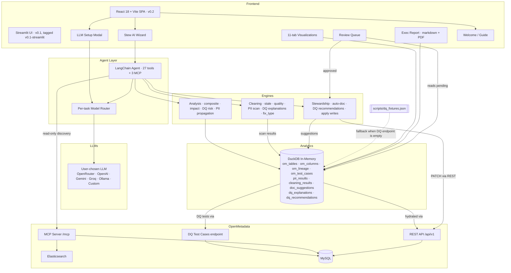

# MetaSift

**An AI-powered metadata analyst and steward that sifts through your OpenMetadata catalog to analyze health, clean dirty metadata, and automate stewardship.**

> Documentation coverage is a lie. A catalog can be 100% documented and still
> full of wrong, stale, conflicting metadata. MetaSift introduces a quality
> score that measures what actually matters.

## The problem

Data catalogs accumulate metadata debt just like code accumulates tech debt. Teams spend weeks documenting tables, classifying PII, and assigning ownership — but nobody fact-checks what's already there. Descriptions go stale as tables get repurposed. The same column gets tagged differently across schemas. Naming conventions drift. The result: a catalog that looks healthy on paper (65% documented!) but is full of inaccurate, inconsistent, and misleading metadata.

Existing tools generate new metadata (auto-documentation) or keep metadata fresh (active syncing). **Nobody audits the quality of existing metadata.** MetaSift does.

## The solution

MetaSift sits on top of OpenMetadata and adds four integrated engines plus a rich interaction surface:

**Analysis** — Treats the catalog as a dataset. Pulls metadata into DuckDB, runs aggregate analytics, and computes a **Composite Score** weighted across coverage, accuracy, consistency, and description quality. Also computes blast-radius (downstream impact), per-team stewardship breakdowns, PII propagation across lineage, and DQ risk (failing tests × downstream blast radius).

**Cleaning** — The quality-audit differentiator. Detects stale descriptions that no longer match column metadata, finds classification conflicts across schemas, scores descriptions 1-5, clusters similar-but-different column names via fuzzy matching, heuristically classifies PII columns with a 5-layer rule set (zero LLM cost), and — new in the DQ track — explains failing data-quality checks in plain English with root-cause hypotheses and classified next-step fixes.

**Stewardship** — Writes the fixes back. Auto-documents undocumented tables (one at a time or a whole schema at once via NL), applies PII tags, recommends DQ tests that should exist but don't, and manages ownership. Every change flows through a **review queue** with Accept / Edit / Reject — no silent writes.

**Stew** — The AI wizard. LangChain agent with **27 local tools** plus 3 allowlisted MCP tools for catalog search and lineage. Every reply carries a "Show your work" expander with the tool calls and raw results. The agent can't write directly — writes always go through the review queue.

On top of that: a **11-tab interactive visualization panel** (Score gauge, Lineage, Governance, Blast radius, Stewardship, Catalog map, Tag conflicts, Quality, DQ failures, DQ gaps, DQ risk), a downloadable **executive markdown report**, and an **LLM setup** surface that lets anyone bring their own OpenAI-compatible key (OpenRouter, OpenAI, Gemini, Groq, Ollama, or custom) with per-task model routing for power users.

## Hackathon issues addressed

MetaSift directly addresses six issues from the WeMakeDevs × OpenMetadata "Back to the Metadata" hackathon board:

| Issue | Title | How MetaSift covers it |
| --- | --- | --- |
| [#26608](https://github.com/open-metadata/OpenMetadata/issues/26608) | Conversational Data Catalog Chat App | **Stew** — full chat experience with 27 local tools, MCP-backed catalog search/lineage, "Show your work" traces |
| [#26659](https://github.com/open-metadata/OpenMetadata/issues/26659) | Human-Readable Explanations for Failed DQ Checks | Ingests `om_test_cases`, LLM writes one-sentence summary + likely_cause + suggested_fix per failure, cached in `dq_explanations` |
| [#26660](https://github.com/open-metadata/OpenMetadata/issues/26660) | AI-Powered Data Quality Recommendations | `recommend_dq_tests(fqn)` grounds the LLM in columns + tags + existing tests and proposes severity-ranked DQ tests that should exist but don't |
| [#26658](https://github.com/open-metadata/OpenMetadata/issues/26658) | Data Quality Checks Impact | `dq_impact(fqn)` joins failing tests × lineage × PII into a risk score; `dq_risk_catalog` ranks where to fix first |
| [#26661](https://github.com/open-metadata/OpenMetadata/issues/26661) | Propose Automated Fixes for Failed DQ Checks | Every DQ explanation includes a `fix_type` classifier (schema_change / etl_investigation / data_correction / upstream_fix) + prose next-step — rendered with colored chips |
| [#25146](https://github.com/open-metadata/OpenMetadata/issues/25146) | Lineage Governance Layer | **Governance** viz tab — lineage DAG recolored by PII status (origin / tainted / clean), propagation edges highlighted red |

## Demo

[Watch the 2-minute demo on YouTube](https://youtu.be/-8sh1UNwvKI)

## Features

### Quality analysis

- **Composite Score** — Weighted health metric (30% coverage + 30% accuracy + 20% consistency + 20% quality)
- **Documentation coverage** by schema
- **Stale description detection** — LLM compares stored descriptions against actual column metadata
- **Description quality scoring** — Rate descriptions 1-5 on specificity, accuracy, completeness (with a partial-JSON salvage path so a truncated LLM response doesn't zero the metric)
- **Classification conflicts** — Same column tagged differently across tables
- **Naming inconsistency clusters** — `customer_id` vs `cust_id` vs `cid` via fuzzy matching

### Data quality track

- **DQ failure explanations** (#26659) — Ingest OM test cases, LLM writes Summary + Likely cause + **Suggested fix** per failure, cached in `dq_explanations`. Synthetic fixture fallback so the feature demos without a configured OM DQ test suite.
- **Fix classification** (#26661) — Every explanation includes a `fix_type` chip: Schema change / ETL investigation / Data correction / Upstream fix / Other. Lets future UIs expose contextual actions (Copy SQL, Open pipeline, Ping producer) per failure type.
- **DQ test recommendations** (#26660) — `recommend_dq_tests(fqn)` proposes tests that should exist but don't. Constrained to a 12-definition OM-test allowlist, filters duplicates against `om_test_cases`, severity-ranked (critical / recommended / nice-to-have).
- **DQ × Lineage risk** (#26658) — `dq_impact(fqn)` multiplies failing-tests by downstream blast radius (PII-amplified). Catalog-wide `dq_risk_catalog` answers *"where should I fix DQ first?"*.

### Governance

- **Lineage governance overlay** (#25146) — PII propagation view: origin tables (🔴 has PII columns directly), tainted tables (🟠 reachable via lineage), clean tables (⚪). Propagation edges highlighted in red so the PII chain pops against the rest of the lineage graph. Single recursive CTE seeded at every origin.

### Stewardship & automation

- **Heuristic PII detection** — 5-layer classifier (exclusions + ordered rules + table-context + confidence tiers), zero LLM cost
- **Auto-documentation** — Generate descriptions for undocumented tables from column context
- **Bulk NL stewardship** — "Auto-document the sales schema" drafts descriptions for every undocumented table at once
- **Human-gated write-back** — Accept / Edit / Reject per suggestion; REST PATCH only after approval

### Impact & accountability

- **Blast radius / impact analysis** — Direct + transitive downstream count per table, weighted by PII.Sensitive footprint
- **Stewardship leaderboard** — Per-team scorecard (tables owned, coverage %, quality, PII footprint)
- **Orphan detection** — Surface tables with no owner

### Interactive exploration

- **Stew** (AI wizard) — Natural-language chat over all of the above; 27 local tools + 3 MCP tools
- **"Show your work"** — Every AI response carries a collapsible expander with the tools called + results
- **11-tab visualization panel** — Score gauge · Lineage · Governance · Blast radius · Stewardship · Catalog map · Tag conflicts · Quality · DQ failures · DQ gaps · DQ risk
- **Executive report export** — Downloadable markdown summary (composite score, stale descriptions, tag conflicts, PII gaps, naming drift)

### Bring-your-own LLM

- **LLM setup modal** — Paste any OpenAI-compatible key (OpenRouter, OpenAI, Gemini, Groq, Ollama, Custom). Six provider presets auto-fill base URL + model hint. Session-scoped; never persisted.
- **MetaSift defaults** — One-click button: paste an OpenRouter key, get the same hybrid routing the project ships with (Llama 3.3 70B for five tasks + GPT-4o-mini for tool-calling).
- **Live model picker** — A dropdown anchored below the chat input with the full OpenRouter catalog (fetched dynamically, ~343 models, type-to-filter). Switch models mid-conversation.
- **Per-task routing** — Advanced expander inside LLM setup: send `toolcall`, `reasoning`, `description`, `stale`, `scoring`, `classification` to different models. Cheap-open-weight for bulk work + reliable-commercial for tool-calling is the default config.
- **First-launch welcome** — Guide modal explains MetaSift + four engines + quick start. Reachable any time via the sidebar **Guide** button.

## What makes MetaSift different

These capabilities don't exist in OpenMetadata, Collate, or any other catalog tool:

- Stale description detection and rewrite
- Composite metadata quality score (accuracy + consistency + quality, not just coverage)
- Conflicting classification detection across schemas
- Inconsistent naming detection and standardization
- Blast-radius / downstream-impact scoring weighted by PII sensitivity
- Per-team stewardship leaderboard + orphan-table detection
- DuckDB-powered aggregate metadata analytics

### Feature comparison

| Feature | OpenMetadata OSS | Collate (paid) | MetaSift |
|---------|:---:|:---:|:---:|
| PII auto-classification | ✅ (batch, spaCy) | ✅ (AI-powered) | ✅ (on-demand, heuristic, zero-LLM) |
| Auto-documentation | ❌ | ✅ | ✅ (single + bulk via NL) |
| NL chat interface | ❌ | ✅ (AskCollate) | ✅ (Stew) |
| Auto-generated charts | ❌ | ✅ | ✅ (7-tab plotly panel) |
| Lineage exploration | ✅ (UI only) | ✅ | ✅ (chat-driven, full DAG viz) |
| Data Insights / health metrics | ✅ (coverage, ownership) | ✅ | ✅ (+ composite score) |
| Review workflow for AI changes | ❌ | ✅ | ✅ |
| **Stale description detection** | ❌ | ❌ | **✅ MetaSift only** |
| **Description quality scoring** | ❌ | ❌ | **✅ MetaSift only** |
| **Conflicting classification detector** | ❌ | ❌ | **✅ MetaSift only** |
| **Inconsistent naming detector** | ❌ | ❌ | **✅ MetaSift only** |
| **Composite metadata quality score** | ❌ | ❌ | **✅ MetaSift only** |
| **Blast-radius impact analysis** | ❌ | ❌ | **✅ MetaSift only** |
| **Per-team stewardship leaderboard** | ❌ | ❌ | **✅ MetaSift only** |
| **DQ failure plain-English explanations** | ❌ | ❌ | **✅ MetaSift only** |
| **AI-powered DQ test recommendations** | ❌ | ❌ | **✅ MetaSift only** |
| **DQ × lineage risk ranking** | ❌ | ❌ | **✅ MetaSift only** |
| **PII propagation overlay on lineage** | ❌ | ❌ | **✅ MetaSift only** |
| **Bring-your-own-LLM + per-task routing** | ❌ | ❌ | **✅ MetaSift only** |
| **DuckDB metadata analytics** | ❌ | ❌ | **✅ MetaSift only** |

> MetaSift brings Collate-level AI capabilities to the open-source community **and** adds a metadata cleaning layer that doesn't exist anywhere — not in OpenMetadata, not in Collate, not in Atlan, Collibra, or any other catalog tool.

## Architecture



## OpenMetadata integration depth

MetaSift uses **three complementary channels** into OpenMetadata, each for what it's best at:

### 1. REST API (`/api/v1`) — bulk reads + gated writes

- `GET /v1/tables?fields=columns,tags,owners,description,profile` — paginated bulk fetch, hydrates DuckDB in one pass
- `GET /v1/tables/name/{fqn}` — single-entity lookup for validation + detail views
- `GET /v1/lineage/table/name/{fqn}?upstreamDepth=1&downstreamDepth=1` — per-table lineage walked during refresh to build an `om_lineage` DuckDB table
- `GET /v1/dataQuality/testCases?fields=testDefinition,testCaseResult` — ingests test cases + latest results for the DQ track; falls back to a synthetic fixture when the endpoint is empty
- `PATCH /v1/tables/name/{fqn}` with `application/json-patch+json` — description updates AND column-tag updates (same endpoint, different ops)
- `PUT /v1/teams` + `PATCH /v1/tables/name/{fqn}` (owners path) — team + ownership management in the seed script

### 2. MCP (`/mcp`) — read-only agent-facing discovery

Loaded via `ai_sdk.AISdk(host, token).mcp.as_langchain_tools()` and filtered by a **hard-coded allowlist** so write-capable MCP ops stay excluded — the review queue is the only write surface.

- `search_metadata` — keyword search across the catalog (any entity type)
- `get_entity_details` — full state of a single entity (used for deep-dive questions)
- `get_entity_lineage` — upstream/downstream traversal (used by Stew for "what depends on X?" queries)

Explicitly **excluded**: `patch_entity` (would bypass the review queue) and `create_glossary*` (out of MetaSift's scope).

### 3. openmetadata-ingestion SDK — pinned for write compatibility

The SDK is pinned in `pyproject.toml` at the server version (1.9.4) to keep pydantic + schema compatibility guaranteed on write-backs.

**Agent tool registry:** 27 local MetaSift tools + 3 allowlisted MCP tools = **30 tools** available to Stew per turn.

## Composite quality score

MetaSift's headline metric — weighted combination:

- Documentation coverage (30%)
- Description accuracy (30%) — % non-stale per the cleaning engine
- Classification consistency (20%) — % of columns without tag conflicts
- Description quality mean (20%) — 1-5 scoring normalized

## Tech stack

| Layer | Technology | Why |
|-------|-----------|-----|
| Metadata platform | OpenMetadata 1.9.4 | Hackathon sponsor; MCP server + REST API + 100+ connectors |
| AI orchestration | LangChain 1.x (`create_agent` / LangGraph) | Unified agent API with streaming + tool calling |
| MCP bridge | `data-ai-sdk` (import `ai_sdk`) | Converts OM's MCP tools into LangChain `BaseTool` instances |
| LLM | Any OpenAI-compatible endpoint | Default: OpenRouter with Llama 3.3 70B (5 tasks) + GPT-4o-mini (tool-calling, avoids Llama's introspection loops). User can swap to OpenAI, Gemini, Groq, Ollama, or a custom endpoint via the in-app LLM setup. |
| Analytics | DuckDB (in-memory) | Zero-config SQL over the metadata cache; recursive CTEs for lineage |
| Frontend (v0.2) | React 18 · Vite · TanStack Query · Tailwind | SPA with multi-conversation chat, ⌘K palette, live SSE streaming, Print→PDF reports |
| Frontend (v0.1) | Streamlit | Original submission demo, preserved at tag `v0.1-streamlit` for iteration history |
| Visualization | Plotly · Plotly.js | Interactive charts shared by both frontends |
| Fuzzy matching | thefuzz | Naming inconsistency detection |
| Deployment | Docker Compose | One-command setup |

## Quick start

### Prerequisites

- Docker Desktop with **6+ GB RAM** and **4+ vCPUs** allocated
- Python 3.11
- An OpenRouter API key (free at [openrouter.ai/keys](https://openrouter.ai/keys))

### Setup

```bash
# 1. Clone + install
git clone https://github.com/blueberrylinux/metasift.git
cd metasift
make install
source .venv/bin/activate

# 2. Start the OpenMetadata stack (takes ~2 min first boot)
make stack-up
make stack-logs        # watch until you see "Started OpenMetadataApplication"

# 3. Generate a token + populate .env
#    Log in at http://localhost:8585 with admin / admin
#    Go to Settings → Bots → ingestion-bot → Generate new token
cp .env.example .env
# Edit .env — paste the token into OPENMETADATA_JWT_TOKEN and AI_SDK_TOKEN.
# OPENROUTER_API_KEY is optional — you can paste an LLM key in the app instead.

# 4. Seed the demo catalog
make seed

# 5. Launch the v0.2 app (FastAPI + React — current)
make run
# → FastAPI on :8000, Vite dev server on :5173
# → open http://localhost:5173

# Optional: see the original v0.1 Streamlit demo
git checkout v0.1-streamlit && make run
# → open http://localhost:8501  (on the v0.1 tag, `make run` runs Streamlit)
```

### First-launch flow

Once the app opens:

1. The **Welcome** dialog explains the four engines + a 3-step quick-start.
2. If your `.env` doesn't have an `OPENROUTER_API_KEY` (or you want a different provider), click **LLM setup** in the sidebar → paste your key → hit **Use MetaSift defaults** for one-click Llama 3.3 + GPT-4o-mini routing. Or pick any of the 6 provider presets / configure per-task routing / dump the 343-model OpenRouter catalog into the chat-area picker.
3. Click **Refresh metadata** to load the seeded catalog.
4. Ask Stew: *"what's my composite score?"* or *"why is my email_not_null check failing?"*

## Project layout

```text
metasift/
├── app/
│   ├── main.py              # Streamlit entry point (v0.1 — preserved for the port story)
│   ├── api/                 # FastAPI port (v0.2 — chat/scans/review/viz/report routers + SQLite store)
│   ├── config.py            # Settings from .env
│   ├── clients/
│   │   ├── llm.py           # LLM client (OpenRouter, per-task model routing)
│   │   ├── openmetadata.py  # REST wrapper + SDK handles
│   │   └── duck.py          # DuckDB store — om_tables, om_columns, om_lineage, om_test_cases
│   └── engines/
│       ├── analysis.py      # Catalog SQL analytics · blast radius · PII propagation · DQ risk
│       ├── stewardship.py   # Auto-doc · bulk per-schema · PII tagging · DQ recommendations · write-back
│       ├── cleaning.py      # Stale detection · quality scoring · heuristic PII · DQ explanations
│       ├── tools.py         # LangChain @tool wrappers over the engines (27 tools)
│       ├── report.py        # Markdown executive report generator
│       ├── viz.py           # Plotly figure builders for the 11-tab viz panel
│       └── agent.py         # LangChain agent over local + MCP tools
├── scripts/
│   ├── seed_messy_catalog.py  # Populate OM with sample catalog data
│   └── dq_fixtures.json       # Synthetic DQ test cases (fallback when OM DQ is empty)
├── tests/                     # pytest smoke tests
├── docker-compose.yml         # OpenMetadata + MySQL + Elasticsearch
├── Dockerfile                 # MetaSift app image (for full containerized demo)
├── pyproject.toml             # Deps (uv-compatible)
├── Makefile                   # make help for all commands
└── .env.example               # Copy to .env and fill
```

## Daily commands

```bash
make help          # list all commands
make stack-up      # start OpenMetadata
make stack-down    # stop + wipe volumes
make stack-logs    # tail server logs
make seed          # populate demo catalog
make run           # launch the v0.2 React app (api on :8000 + Vite on :5173, parallel)
make api           # launch only the FastAPI backend (port 8000)
make web           # launch only the Vite dev server (port 5173)
make reset-all     # wipe + reseed (sqlite + duck + OM volumes)
make lint          # ruff check + format
make test          # pytest
# v0.1 Streamlit demo: git checkout v0.1-streamlit && make run
```

## Privacy

MetaSift only sends structural metadata to external LLMs — column names, data types, table names, and descriptions. It never sends sample data or actual records.

## Future roadmap

- Scheduled stewardship runs (nightly auto-documentation + cleaning via APScheduler or OM's airflow-based ingestion framework)
- Multi-catalog support (compare dev/staging/prod quality over time)
- Data contract validation using OpenMetadata's Contracts API
- Column profiler integration — pull row counts / null % / distinct-value stats for real source DBs and factor into the quality score
- DQ test cases as a 5th composite-score dimension
- Slack / Jira integrations (webhook to notify stewards + file tickets) via the existing `fix_type` classifier
- Contribute MetaSift's local tools (e.g. `impact_check`, `pii_propagation`, `dq_failures_summary`) back to OpenMetadata's MCP server
- ~~FastAPI + React port — engines stay, UI gets rebuilt~~ — **shipped in v0.2** (April 26, 2026), now on `main`. The original Streamlit demo is preserved at the [`v0.1-streamlit`](https://github.com/blueberrylinux/metasift/releases/tag/v0.1-streamlit) tag; see the v0.1 → v0.2 section in [SUBMISSION.md](SUBMISSION.md) for the port story.
- Custom agent workflows (no-code builder)
- Plugin system for industry-specific analyzers

## Troubleshooting

**OpenMetadata won't start / healthcheck fails.** Give it 2-3 minutes on first boot — the MySQL and Elasticsearch init is slow. Watch `make stack-logs`.

**MetaSift returns 401 / "couldn't reach OpenMetadata" after a `stack-down` + `stack-up`.** `docker compose down -v` wipes the MySQL volume, which wipes the `ingestion-bot`. On the next stack-up, OM creates a new bot with a new JWT — your old token in `.env` is now stale. Rotate it: open <http://localhost:8585> → Settings → Bots → ingestion-bot → revoke + generate new token → paste into `.env` as both `OPENMETADATA_JWT_TOKEN` and `AI_SDK_TOKEN` → restart the API (`make api`). Same applies after `make reset-all`.

**`openmetadata-ingestion` install fails on Windows.** You're not on WSL. This project is designed for WSL 2 / Linux — the Windows install path has pydantic version issues.

**OpenRouter rate limits.** Free-tier models have per-minute request limits that vary by model (and some, like the `:free` Llama 3.3 variant served via Venice, 429 under any real load). Either click **Use MetaSift defaults** in the LLM setup modal — it routes the shared model to paid Llama 3.3 (~$0.12/1M tokens) with GPT-4o-mini for tool-calling — or pick any other provider preset and paste the corresponding key. You can also swap models live via the dropdown above the chat input.

**Port 8585 already in use.** Another OpenMetadata instance is running. `docker ps` to check, then `docker stop <id>`.

## AI Tools

Built with assistance from [Claude Code](https://claude.ai/code) (Anthropic).

## License

MIT
