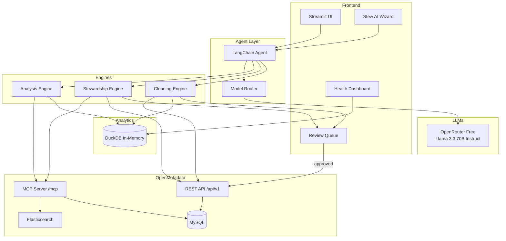

# MetaSift

**An AI-powered metadata analyst and steward that sifts through your OpenMetadata catalog to analyze health, clean dirty metadata, and automate stewardship.**

> Documentation coverage is a lie. A catalog can be 100% documented and still
> full of wrong, stale, conflicting metadata. MetaSift introduces a quality
> score that measures what actually matters.

## The problem

Data catalogs accumulate metadata debt just like code accumulates tech debt. Teams spend weeks documenting tables, classifying PII, and assigning ownership — but nobody fact-checks what's already there. Descriptions go stale as tables get repurposed. The same column gets tagged differently across schemas. Naming conventions drift. The result: a catalog that looks healthy on paper (65% documented!) but is full of inaccurate, inconsistent, and misleading metadata.

Existing tools generate new metadata (auto-documentation) or keep metadata fresh (active syncing). **Nobody audits the quality of existing metadata.** MetaSift does.

## The solution

MetaSift is built on top of OpenMetadata and provides four integrated engines:

**Analysis** — Treats your metadata catalog as a dataset. Pulls all metadata into DuckDB, runs aggregate analytics, and generates a health dashboard with a composite quality score that goes beyond simple coverage metrics.

**Cleaning** — The differentiator. Detects stale descriptions that no longer match table contents, finds classification conflicts across schemas, scores description quality 1-5, and identifies naming inconsistencies. No other tool does this.

**Stewardship** — Auto-documents undocumented tables using LLM-generated descriptions with lineage and profiler context. Detects and classifies PII columns. All changes go through a human-in-the-loop review workflow.

**Stew** — An AI wizard persona that guides users through natural language. Ask questions, trigger actions, and get explanations — all in one chat interface with "show your work" transparency.

## Demo

[Demo video — coming soon]

## Features

- **Health dashboard** — Documentation coverage, quality score, PII %, ownership % by schema
- **NL metadata queries** — "Which schemas have the worst documentation?"
- **Auto-documentation** — Generate descriptions for undocumented tables using column/lineage context
- **PII detection** — LLM-based classification with confidence scores
- **Stale description detection** — Find descriptions that don't match actual table contents
- **Conflicting classification detector** — Same column tagged differently across tables
- **Description quality scoring** — Rate descriptions 1-5 on specificity and accuracy
- **Inconsistent naming detector** — Cluster similar column names across schemas
- **Review workflow** — Accept/edit/reject all AI suggestions before write-back
- **"Show your work"** — Every AI response shows the tools called and evidence used
- **One-command Docker setup** — `docker compose up -d` and ready in 5 minutes

## What makes MetaSift different

These capabilities don't exist in OpenMetadata, Collate, or any other catalog tool:

- Stale description detection and rewrite
- Composite metadata quality score (accuracy + consistency + quality, not just coverage)
- Conflicting classification detection across schemas
- Inconsistent naming detection and standardization
- DuckDB-powered aggregate metadata analytics

### Feature comparison

| Feature | OpenMetadata OSS | Collate (paid) | MetaSift |
|---------|:---:|:---:|:---:|
| PII auto-classification | ✅ (batch, spaCy) | ✅ (AI-powered) | ✅ (on-demand, LLM, NL-triggered) |
| Auto-documentation | ❌ | ✅ | ✅ |
| NL chat interface | ❌ | ✅ (AskCollate) | ✅ (Stew) |
| Auto-generated charts | ❌ | ✅ | ✅ |
| Lineage exploration | ✅ (UI only) | ✅ | ✅ (+ blast radius scoring) |
| Data Insights / health metrics | ✅ (coverage, ownership) | ✅ | ✅ (+ composite quality score) |
| Review workflow for AI changes | ❌ | ✅ | ✅ |
| **Stale description detection** | ❌ | ❌ | **✅ MetaSift only** |
| **Description quality scoring** | ❌ | ❌ | **✅ MetaSift only** |
| **Conflicting classification detector** | ❌ | ❌ | **✅ MetaSift only** |
| **Inconsistent naming detector** | ❌ | ❌ | **✅ MetaSift only** |
| **Composite metadata quality score** | ❌ | ❌ | **✅ MetaSift only** |
| **DuckDB metadata analytics** | ❌ | ❌ | **✅ MetaSift only** |

> MetaSift brings Collate-level AI capabilities to the open-source community **and** adds a metadata cleaning layer that doesn't exist anywhere — not in OpenMetadata, not in Collate, not in Atlan, Collibra, or any other catalog tool.

## Architecture



## OpenMetadata integration depth

MetaSift touches 14 integration points across MCP and REST APIs:

**MCP tools (5):** search_metadata, get_entity_details, get_entity_lineage, create_glossary, create_glossary_term

**REST API endpoints (9):** PATCH tables (descriptions), PATCH tables (tags), GET tables (bulk listing), GET table profiles (profiler data), GET data quality test cases, GET tags/classifications, GET glossary terms, POST glossary terms, GET users (owner listing)

## Composite quality score

MetaSift's headline metric — weighted combination:

- Documentation coverage (30%)
- Description accuracy (30%) — % non-stale per the cleaning engine
- Classification consistency (20%) — % of columns without tag conflicts
- Description quality mean (20%) — 1-5 scoring normalized

## Tech stack

| Layer | Technology | Why |
|-------|-----------|-----|
| Metadata platform | OpenMetadata 1.9.4 | Hackathon sponsor, MCP server, 100+ connectors |
| AI orchestration | LangChain + AI SDK | Official integration path for MCP to LLM tools |
| LLM (free) | OpenRouter (Llama 3.3 70B Instruct) | $0 cost, strong tool-calling, per-task routing |
| Analytics | DuckDB | In-process SQL on metadata, zero config |
| Frontend | Streamlit | Rapid UI, native chat + charts |
| Visualization | Plotly | Interactive charts in Streamlit |
| Fuzzy matching | thefuzz | Naming inconsistency detection |
| Deployment | Docker Compose | One-command setup |

## Quick start

### Prerequisites

- Docker Desktop with **6+ GB RAM** and **4+ vCPUs** allocated
- Python 3.11
- An OpenRouter API key (free at [openrouter.ai/keys](https://openrouter.ai/keys))

### Setup

```bash
# Clone the repo
git clone https://github.com/blueberrylinux/metasift.git
cd metasift

# Install Python deps
make install
source .venv/bin/activate

# Copy env template and fill in your keys
cp .env.example .env
# Edit .env — set OPENROUTER_API_KEY

# Start the OpenMetadata stack (takes ~2 min first boot)
make stack-up
make stack-logs        # watch until you see "Started OpenMetadataApplication"

# Log in at http://localhost:8585
#    Default creds: admin / admin
#    Then: Settings → Bots → ingestion-bot → Generate new token
#    Paste that token into .env as OPENMETADATA_JWT_TOKEN and AI_SDK_TOKEN

# Seed the demo catalog with sample metadata
make seed

# Launch the app
make run
# → open http://localhost:8501
```

## Project layout

```
metasift/
├── app/
│   ├── main.py              # Streamlit entry point
│   ├── config.py            # Settings from .env
│   ├── clients/
│   │   ├── llm.py           # LLM client (OpenRouter, per-task model routing)
│   │   ├── openmetadata.py  # SDK + REST wrapper
│   │   └── duck.py          # DuckDB store (metadata as a dataset)
│   └── engines/
│       ├── analysis.py      # Catalog-wide SQL analytics
│       ├── stewardship.py   # Auto-doc, PII tagging, write-back
│       ├── cleaning.py      # Stale detection, conflicts, quality scoring
│       └── agent.py         # LangChain agent over MCP tools
├── scripts/
│   └── seed_messy_catalog.py  # Populate OM with sample catalog data
├── tests/                     # pytest smoke tests
├── docker-compose.yml         # OpenMetadata + MySQL + Elasticsearch
├── Dockerfile                 # MetaSift app image (for full containerized demo)
├── pyproject.toml             # Deps (uv-compatible)
├── Makefile                   # make help for all commands
└── .env.example               # Copy to .env and fill
```

## Daily commands

```bash
make help          # list all commands
make stack-up      # start OpenMetadata
make stack-down    # stop + wipe volumes
make stack-logs    # tail server logs
make seed          # populate demo catalog
make run           # launch Streamlit
make lint          # ruff check + format
make test          # pytest
```

## Privacy

MetaSift only sends structural metadata to external LLMs — column names, data types, table names, and descriptions. It never sends sample data or actual records.

## Future roadmap

- Scheduled stewardship runs (nightly auto-documentation + cleaning)
- Local LLM fallback via Ollama for air-gapped environments
- Multi-catalog support (compare dev/staging/prod)
- Data contract validation using OpenMetadata's Contracts API
- Team stewardship scoring and leaderboards
- Custom agent workflows (no-code builder)
- Plugin system for industry-specific analyzers

## Troubleshooting

**OpenMetadata won't start / healthcheck fails.** Give it 2-3 minutes on first boot — the MySQL and Elasticsearch init is slow. Watch `make stack-logs`.

**`openmetadata-ingestion` install fails on Windows.** You're not on WSL. This project is designed for WSL 2 / Linux — the Windows install path has pydantic version issues.

**OpenRouter rate limits.** Free-tier models have per-minute request limits that vary by model. If you hit them, switch to a different free model in `.env` (browse at [openrouter.ai/models?pricing=free](https://openrouter.ai/models?pricing=free)).

**Port 8585 already in use.** Another OpenMetadata instance is running. `docker ps` to check, then `docker stop <id>`.

## AI Tools

Built with assistance from [Claude Code](https://claude.ai/code) (Anthropic).

## License

MIT
