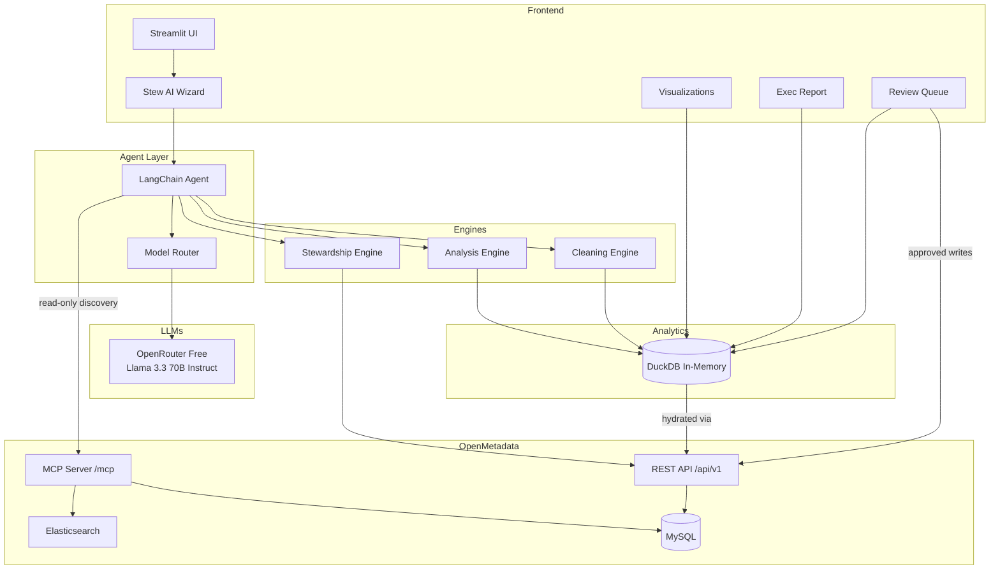

# MetaSift

**An AI-powered metadata analyst and steward that sifts through your OpenMetadata catalog to analyze health, clean dirty metadata, and automate stewardship.**

> Documentation coverage is a lie. A catalog can be 100% documented and still
> full of wrong, stale, conflicting metadata. MetaSift introduces a quality
> score that measures what actually matters.

## The problem

Data catalogs accumulate metadata debt just like code accumulates tech debt. Teams spend weeks documenting tables, classifying PII, and assigning ownership — but nobody fact-checks what's already there. Descriptions go stale as tables get repurposed. The same column gets tagged differently across schemas. Naming conventions drift. The result: a catalog that looks healthy on paper (65% documented!) but is full of inaccurate, inconsistent, and misleading metadata.

Existing tools generate new metadata (auto-documentation) or keep metadata fresh (active syncing). **Nobody audits the quality of existing metadata.** MetaSift does.

## The solution

MetaSift sits on top of OpenMetadata and adds four integrated engines plus a rich interaction surface:

**Analysis** — Treats the catalog as a dataset. Pulls metadata into DuckDB, runs aggregate analytics, and computes a **composite quality score** weighted across coverage, accuracy, consistency, and description quality. Also computes blast-radius (downstream impact) and per-team stewardship breakdowns.

**Cleaning** — The quality-audit differentiator. Detects stale descriptions that no longer match column metadata, finds classification conflicts across schemas, scores descriptions 1-5, clusters similar-but-different column names via fuzzy matching, and heuristically classifies PII columns with a 5-layer rule set (zero LLM cost).

**Stewardship** — Writes the fixes back. Auto-documents undocumented tables (one at a time or a whole schema at once via NL), applies PII tags, and manages ownership. Every change flows through a **review queue** with Accept / Edit / Reject — no silent writes.

**Stew** — The AI wizard. LangChain agent with 18 local tools plus 3 allowlisted MCP tools for catalog search and lineage. Every reply carries a "Show your work" expander with the tool calls and raw results. The agent can't write directly — writes always go through the review queue.

On top of that: a 7-tab **interactive visualization panel** (composite gauge, lineage DAG, blast-radius bars, stewardship leaderboard, catalog treemap, tag-conflict heatmap, quality histogram), and a downloadable **executive markdown report** summarizing every finding for stakeholders.

## Demo

[Demo video — coming soon]

## Features

### Quality analysis

- **Composite quality score** — Weighted health metric (30% coverage + 30% accuracy + 20% consistency + 20% quality)
- **Documentation coverage** by schema
- **Stale description detection** — LLM compares stored descriptions against actual column metadata
- **Description quality scoring** — Rate descriptions 1-5 on specificity, accuracy, completeness
- **Classification conflicts** — Same column tagged differently across tables
- **Naming inconsistency clusters** — `customer_id` vs `cust_id` vs `cid` via fuzzy matching

### Stewardship & automation

- **Heuristic PII detection** — 5-layer classifier (exclusions + ordered rules + table-context + confidence tiers), zero LLM cost
- **Auto-documentation** — Generate descriptions for undocumented tables from column context
- **Bulk NL stewardship** — "Auto-document the sales schema" drafts descriptions for every undocumented table at once
- **Human-gated write-back** — Accept / Edit / Reject per suggestion; REST PATCH only after approval

### Impact & accountability

- **Blast radius / impact analysis** — Direct + transitive downstream count per table, weighted by PII.Sensitive footprint
- **Stewardship leaderboard** — Per-team scorecard (tables owned, coverage %, quality, PII footprint)
- **Orphan detection** — Surface tables with no owner

### Interactive exploration

- **Stew** (AI wizard) — Natural-language chat over all of the above; MCP + local tool channels
- **"Show your work"** — Every AI response carries a collapsible expander with the tools called + results
- **7-tab visualization panel** — Composite gauge, lineage DAG, blast radius bars, stewardship leaderboard, catalog treemap, tag conflicts heatmap, quality histogram
- **Executive report export** — Downloadable markdown summary (composite score, stale descriptions, tag conflicts, PII gaps, naming drift)

## What makes MetaSift different

These capabilities don't exist in OpenMetadata, Collate, or any other catalog tool:

- Stale description detection and rewrite
- Composite metadata quality score (accuracy + consistency + quality, not just coverage)
- Conflicting classification detection across schemas
- Inconsistent naming detection and standardization
- Blast-radius / downstream-impact scoring weighted by PII sensitivity
- Per-team stewardship leaderboard + orphan-table detection
- DuckDB-powered aggregate metadata analytics

### Feature comparison

| Feature | OpenMetadata OSS | Collate (paid) | MetaSift |
|---------|:---:|:---:|:---:|
| PII auto-classification | ✅ (batch, spaCy) | ✅ (AI-powered) | ✅ (on-demand, heuristic, zero-LLM) |
| Auto-documentation | ❌ | ✅ | ✅ (single + bulk via NL) |
| NL chat interface | ❌ | ✅ (AskCollate) | ✅ (Stew) |
| Auto-generated charts | ❌ | ✅ | ✅ (7-tab plotly panel) |
| Lineage exploration | ✅ (UI only) | ✅ | ✅ (chat-driven, full DAG viz) |
| Data Insights / health metrics | ✅ (coverage, ownership) | ✅ | ✅ (+ composite quality score) |
| Review workflow for AI changes | ❌ | ✅ | ✅ |
| **Stale description detection** | ❌ | ❌ | **✅ MetaSift only** |
| **Description quality scoring** | ❌ | ❌ | **✅ MetaSift only** |
| **Conflicting classification detector** | ❌ | ❌ | **✅ MetaSift only** |
| **Inconsistent naming detector** | ❌ | ❌ | **✅ MetaSift only** |
| **Composite metadata quality score** | ❌ | ❌ | **✅ MetaSift only** |
| **Blast-radius impact analysis** | ❌ | ❌ | **✅ MetaSift only** |
| **Per-team stewardship leaderboard** | ❌ | ❌ | **✅ MetaSift only** |
| **DuckDB metadata analytics** | ❌ | ❌ | **✅ MetaSift only** |

> MetaSift brings Collate-level AI capabilities to the open-source community **and** adds a metadata cleaning layer that doesn't exist anywhere — not in OpenMetadata, not in Collate, not in Atlan, Collibra, or any other catalog tool.

## Architecture



## OpenMetadata integration depth

MetaSift uses **three complementary channels** into OpenMetadata, each for what it's best at:

### 1. REST API (`/api/v1`) — bulk reads + gated writes

- `GET /v1/tables?fields=columns,tags,owners,description,profile` — paginated bulk fetch, hydrates DuckDB in one pass
- `GET /v1/tables/name/{fqn}` — single-entity lookup for validation + detail views
- `GET /v1/lineage/table/name/{fqn}?upstreamDepth=1&downstreamDepth=1` — per-table lineage walked during refresh to build an `om_lineage` DuckDB table
- `PATCH /v1/tables/name/{fqn}` with `application/json-patch+json` — description updates AND column-tag updates (same endpoint, different ops)
- `PUT /v1/teams` + `PATCH /v1/tables/name/{fqn}` (owners path) — team + ownership management in the seed script

### 2. MCP (`/mcp`) — read-only agent-facing discovery

Loaded via `ai_sdk.AISdk(host, token).mcp.as_langchain_tools()` and filtered by a **hard-coded allowlist** so write-capable MCP ops stay excluded — the review queue is the only write surface.

- `search_metadata` — keyword search across the catalog (any entity type)
- `get_entity_details` — full state of a single entity (used for deep-dive questions)
- `get_entity_lineage` — upstream/downstream traversal (used by Stew for "what depends on X?" queries)

Explicitly **excluded**: `patch_entity` (would bypass the review queue) and `create_glossary*` (out of MetaSift's scope).

### 3. openmetadata-ingestion SDK — pinned for write compatibility

The SDK is pinned in `pyproject.toml` at the server version (1.9.4) to keep pydantic + schema compatibility guaranteed on write-backs.

**Agent tool registry:** 18 local MetaSift tools + 3 allowlisted MCP tools = **21 tools** available to Stew per turn.

## Composite quality score

MetaSift's headline metric — weighted combination:

- Documentation coverage (30%)
- Description accuracy (30%) — % non-stale per the cleaning engine
- Classification consistency (20%) — % of columns without tag conflicts
- Description quality mean (20%) — 1-5 scoring normalized

## Tech stack

| Layer | Technology | Why |
|-------|-----------|-----|
| Metadata platform | OpenMetadata 1.9.4 | Hackathon sponsor; MCP server + REST API + 100+ connectors |
| AI orchestration | LangChain 1.x (`create_agent` / LangGraph) | Unified agent API with streaming + tool calling |
| MCP bridge | `data-ai-sdk` (import `ai_sdk`) | Converts OM's MCP tools into LangChain `BaseTool` instances |
| LLM (free) | OpenRouter | Llama 3.3 70B for most tasks, GPT-4o-mini for tool-calling (Llama was looping on introspection) |
| Analytics | DuckDB (in-memory) | Zero-config SQL over the metadata cache; recursive CTEs for lineage |
| Frontend | Streamlit | Chat pane, review queue panel, visualizations panel — all with session state |
| Visualization | Plotly | Interactive charts in Streamlit |
| Fuzzy matching | thefuzz | Naming inconsistency detection |
| Deployment | Docker Compose | One-command setup |

## Quick start

### Prerequisites

- Docker Desktop with **6+ GB RAM** and **4+ vCPUs** allocated
- Python 3.11
- An OpenRouter API key (free at [openrouter.ai/keys](https://openrouter.ai/keys))

### Setup

```bash
# Clone the repo
git clone https://github.com/blueberrylinux/metasift.git
cd metasift

# Install Python deps
make install
source .venv/bin/activate

# Copy env template and fill in your keys
cp .env.example .env
# Edit .env — set OPENROUTER_API_KEY

# Start the OpenMetadata stack (takes ~2 min first boot)
make stack-up
make stack-logs        # watch until you see "Started OpenMetadataApplication"

# Log in at http://localhost:8585
#    Default creds: admin / admin
#    Then: Settings → Bots → ingestion-bot → Generate new token
#    Paste that token into .env as OPENMETADATA_JWT_TOKEN and AI_SDK_TOKEN

# Seed the demo catalog with sample metadata
make seed

# Launch the app
make run
# → open http://localhost:8501
```

## Project layout

```
metasift/
├── app/
│   ├── main.py              # Streamlit entry point (chat, review queue, viz panel)
│   ├── config.py            # Settings from .env
│   ├── clients/
│   │   ├── llm.py           # LLM client (OpenRouter, per-task model routing)
│   │   ├── openmetadata.py  # REST wrapper + SDK handles
│   │   └── duck.py          # DuckDB store — om_tables, om_columns, om_lineage
│   └── engines/
│       ├── analysis.py      # Catalog-wide SQL analytics + blast radius + ownership breakdown
│       ├── stewardship.py   # Auto-doc, bulk per-schema, PII tagging, write-back
│       ├── cleaning.py      # Stale detection, conflicts, quality scoring, heuristic PII
│       ├── tools.py         # LangChain @tool wrappers over the engines (18 tools)
│       ├── report.py        # Markdown executive report generator
│       ├── viz.py           # Plotly figure builders for the 7-tab viz panel
│       └── agent.py         # LangChain agent over local + MCP tools
├── scripts/
│   └── seed_messy_catalog.py  # Populate OM with sample catalog data
├── tests/                     # pytest smoke tests
├── docker-compose.yml         # OpenMetadata + MySQL + Elasticsearch
├── Dockerfile                 # MetaSift app image (for full containerized demo)
├── pyproject.toml             # Deps (uv-compatible)
├── Makefile                   # make help for all commands
└── .env.example               # Copy to .env and fill
```

## Daily commands

```bash
make help          # list all commands
make stack-up      # start OpenMetadata
make stack-down    # stop + wipe volumes
make stack-logs    # tail server logs
make seed          # populate demo catalog
make run           # launch Streamlit
make lint          # ruff check + format
make test          # pytest
```

## Privacy

MetaSift only sends structural metadata to external LLMs — column names, data types, table names, and descriptions. It never sends sample data or actual records.

## Future roadmap

- Scheduled stewardship runs (nightly auto-documentation + cleaning via APScheduler or OM's airflow-based ingestion framework)
- Local LLM fallback via Ollama for air-gapped environments
- Multi-catalog support (compare dev/staging/prod quality over time)
- Data contract validation using OpenMetadata's Contracts API
- Column profiler integration — pull row counts / null % / distinct-value stats for real source DBs and factor into the quality score
- Data quality test cases as a 5th composite-score dimension
- Custom agent workflows (no-code builder)
- Plugin system for industry-specific analyzers

## Troubleshooting

**OpenMetadata won't start / healthcheck fails.** Give it 2-3 minutes on first boot — the MySQL and Elasticsearch init is slow. Watch `make stack-logs`.

**`openmetadata-ingestion` install fails on Windows.** You're not on WSL. This project is designed for WSL 2 / Linux — the Windows install path has pydantic version issues.

**OpenRouter rate limits.** Free-tier models have per-minute request limits that vary by model. If you hit them, switch to a different free model in `.env` (browse at [openrouter.ai/models?pricing=free](https://openrouter.ai/models?pricing=free)).

**Port 8585 already in use.** Another OpenMetadata instance is running. `docker ps` to check, then `docker stop <id>`.

## AI Tools

Built with assistance from [Claude Code](https://claude.ai/code) (Anthropic).

## License

MIT
